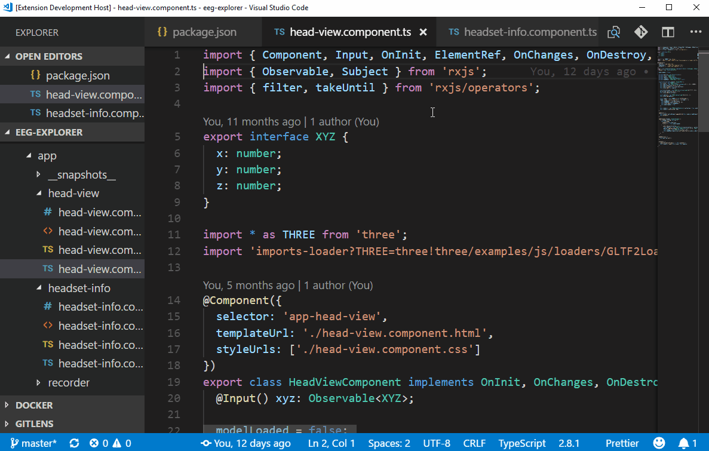

# TSQuery for VSCode

TSQuery enables powerful source code search in TypeScript and JavaScript projects.

## Features

You can use TSQuery to search your source code using an AST query. AST queries are similar to CSS selectors - they let you drill down the hierarchy of code declarations and match the specific language elements that you are looking for.

For instance, the following demo shows how to search for a parameter of a class constructors in the current file:

> Tip: You can find out which selector matches a certain part of your source code by simply hovering it and looking for "AST Selector" inside the tooltip.

This extension is still in development - we are looking for ideas to improve the searching experience. You are invited to [contribute](https://github.com/urish/vscode-tsquery).

## Release Notes

### 0.1.1

Fix GIF animation

### 0.1.0

Initial release of TSQuery
